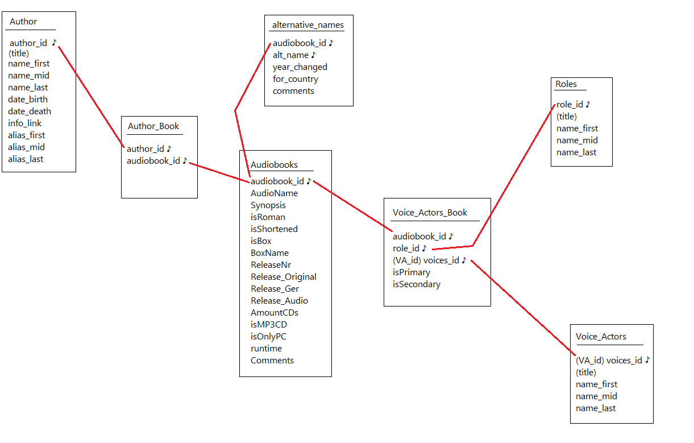

# AudiobookDB
  Interactions with AudiobookDB mysql database.

Database for my Dads audiobooks. 
As he is german and his english isn't the best, most of the output is in german. 
English might be added later on.. but it's rather unlikely. 
 
Dividing the whole project in two different scripts is mostly for security reasons: 
audiobookDB_addEntries has a user that's allowed to freely add, modify and delete anything within the database. 
audiobookDB_readEntries (to be created) has a user that's only allowed to read entries. 
 
Database contains Author, (Audio)Book, Reader and Role Information 
and looks something along the lines of: 

♪ represents primary keys 
Red lines are foreign key connections/constraints 
It's not quite the final Database, but should give a proper idea.